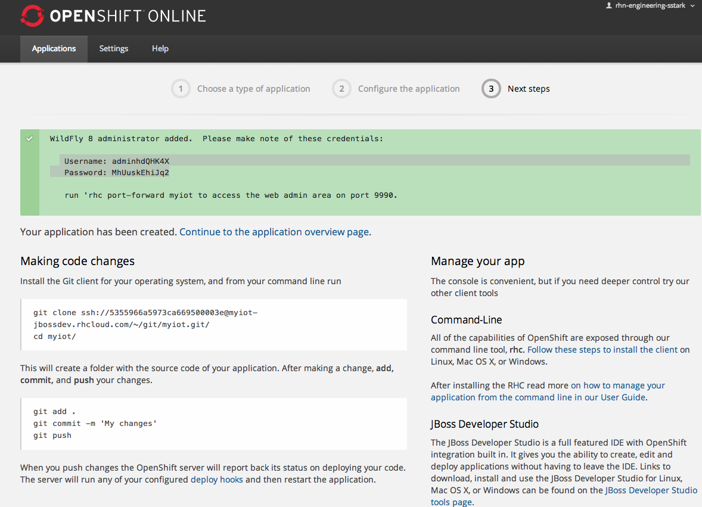

# Red Hat/ARM IoT App on OpenShift
 + 

Summary: A collection of projects that interfaces with the
[Sensinode Developer](https://silver.arm.com/browse/SEN00) NanoService 1.11 Developer
Release to expose the sensors of [mbed LPC1768](https://mbed.org/platforms/mbed-LPC1768/) +
[mbed Application Board](https://mbed.org/components/mbed-Application-Board/) combination as POJOs in the JBoss Wildfly server running on OpenShift.

# Introduction
---------------------

This project includes EE7 component projects that illustrate connecting to the ARM NSP server to expose the sensor information as POJOs.

* iotbof-ear : The EE7 EAR containing the project EJB, WAR
* iotbof-ejb : An EE7 singleton EJB that connects to the NSP
* iotbof-rest : A wrapper api that communicates with the NSP endpoints using REST
* iotbof-test : Tests for the project elements
* iotbof-web : A web application that receives push notifications of sensor information
as well as simple web pages for viewing the sensor data.

## Requirements
You will need an [OpenShift Online](https://www.openshift.com/app/account/new) account and [Install the OpenShift RHC Client Tools](https://www.openshift.com/developers/rhc-client-tools-install).

# Create the Wildfly Application
-------------------
Login to your OpenShift Online account and access the [Applications](https://openshift.redhat.com/app/console/applications) console to create a new Wildfly application that uses the [DevNation2014](https://github.com/starksm64/DevNation2014) git project.

1. Click the Wildfly 8 button to create start the deployment process
2. Enter your Public URL to use for the application. Here I'm using myiot-jbossdev.rhcloud.com 
3. Set the Source Code to the https://github.com/starksm64/DevNation2014OS Git repository.
4. Click  to finish the application create process
5. The resulting Next steps page will show you the locations of the application git repository to clone.
    * Copy the git clone command line shown and run that on your local computer to pull the application repository down from OpenShift.
6. cd into the local git repository
7. git pull -s recursive -X theirs https://github.com/starksm64/DevNation2014OS.git
8. git remote add DevNation2014 https://github.com/starksm64/DevNation2014.git
9. git fetch DevNation2014
10. git merge -s ours --no-commit DevNation2014/master
11. git read-tree --prefix=DevNation2014 -u DevNation2014/master
12. rm -rf DevNation2014/Presentation
13. Edit the .openshift/config/standalone.xml configuration and update the subsystem xmlns="urn:jboss:domain:naming:2.0" section to be as shown here:

        <subsystem xmlns="urn:jboss:domain:naming:2.0">
            <bindings>
                <simple name="java:global/NSPDomain" value="domain" type="java.lang.String"/>
                <simple name="java:global/NSPUsername" value="admin" type="java.lang.String"/>
                <simple name="java:global/NSPPassword" value="secret" type="java.lang.String"/>
                <simple name="java:global/NSPURL" value="http://red-hat-summit.cloudapp.net:8080/" type="java.lang.String"/>
                <simple name="java:global/NotificationCallbackURL" value="http://${env.OPENSHIFT_GEAR_DNS}/iotbof-web/rest/events/send" type="java.net.URL"/>
            </bindings>
            <remote-naming/>
        </subsystem>

* The NSPDomain binding provides the domain name on the NSP server for the sensors.
* The NSPURL provides the base URL for the NSP REST interface
* The NSPUsername is the username used to login to the NSP server. You will be given one for your group.
* The NSPPassword is the password used to login to the NSP server. You will be given one for your group.
* The wildfly.host is the public NIC IP address your Wildfly server is bound to.

## Building the Project
Commit the changes and then push the project to build it on the OpenShift server. The first time you do this it will take a while as all of the maven dependencies need to be pulled in.

The end of my build output looked like:
remote: [INFO] Executing tasks
remote: 
remote: main:
remote:      [echo] Copying iot-ear.ear to deployments...
remote:      [copy] Copying 1 file to /var/lib/openshift/5355fbd9500446d0bb0002f6/app-root/runtime/repo/deployments
remote: [INFO] Executed tasks
remote: [INFO] ------------------------------------------------------------------------
remote: [INFO] Reactor Summary:
remote: [INFO] 
remote: [INFO] iotbof ............................................ SUCCESS [4.207s]
remote: [INFO] IoT BOF SDK ....................................... SUCCESS [1:52.402s]
remote: [INFO] IoT BOF EJBs ...................................... SUCCESS [16.570s]
remote: [INFO] IoT BOF WARs ...................................... SUCCESS [48.541s]
remote: [INFO] IoT BOF EAR ....................................... SUCCESS [14.700s]
remote: [INFO] IoT BOF Tests ..................................... SUCCESS [17.187s]
remote: [INFO] DevNation IoT ..................................... SUCCESS [5.396s]
remote: [INFO] ------------------------------------------------------------------------
remote: [INFO] BUILD SUCCESS
remote: [INFO] ------------------------------------------------------------------------
remote: [INFO] Total time: 3:44.077s
remote: [INFO] Finished at: Tue Apr 22 01:44:32 EDT 2014
remote: [INFO] Final Memory: 72M/232M
remote: [INFO] ------------------------------------------------------------------------
remote: Preparing build for deployment
remote: Deployment id is bd43f3d7
remote: Activating deployment
remote: Deploying WildFly
remote: Starting wildfly cart
remote: Found 127.6.191.1:8080 listening port
remote: Found 127.6.191.1:9990 listening port
remote: CLIENT_MESSAGE: Could not connect to WildFly management interface, skipping deployment verification
remote: -------------------------
remote: Git Post-Receive Result: success
remote: Activation status: success
remote: Deployment completed with status: success
To ssh://5355fbd9500446d0bb0002f6@myiot-jbossdev.rhcloud.com/~/git/myiot.git/
   b549cd6..cbe053c  master -> master

At this point the http://myiot-jbossdev.rhcloud.com/iotbof-web/ application was deployed and accessible.

# MBed.org
There are two mock sensors that are available for testing by default on the NSP server. If you have an mbed device from the DevNation lab, or have bought one from [mbed.org](http://mbed.org/), you can use the RedHatSummit_NanoService_Ethernet firmware projects as described on the [RedHat-Summit-2014-Wiki](https://mbed.org/teams/MBED_DEMOS/wiki/RedHat-Summit-2014-Wiki) to connect your device to the NSP server running in the cloud. You will then be able to view and control your device using the OpenShift application.
